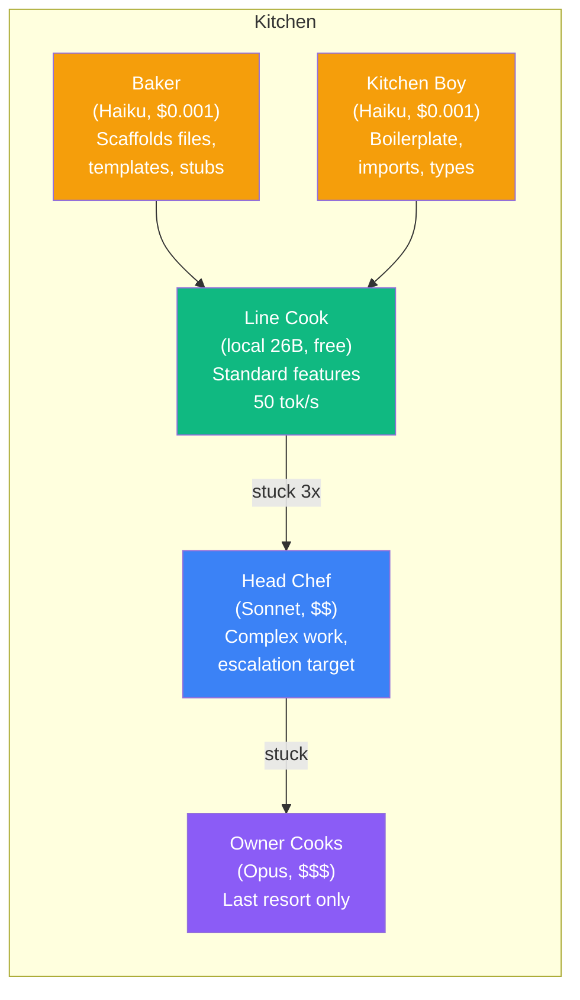
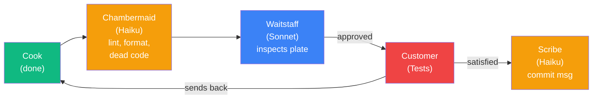
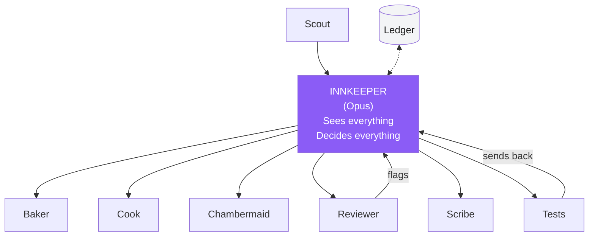
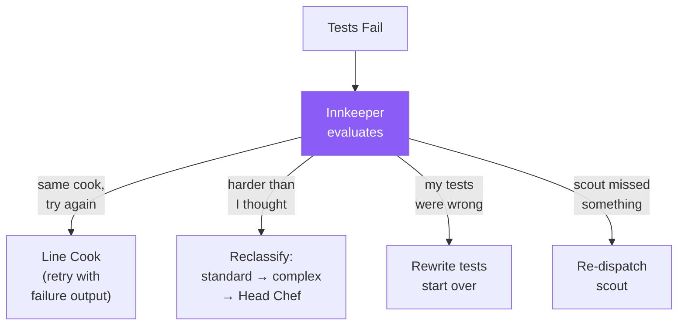
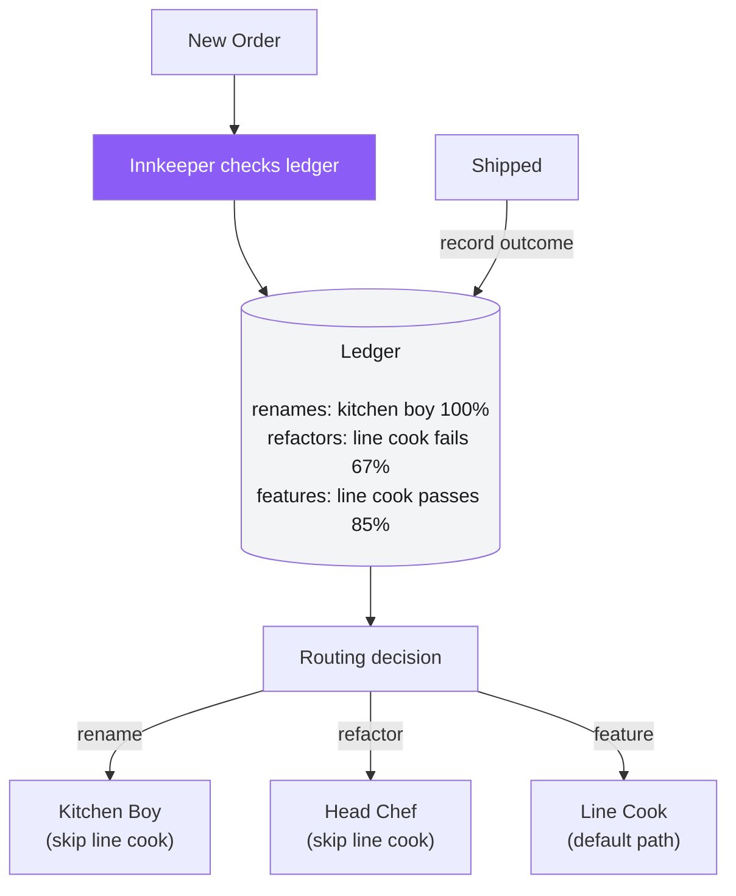
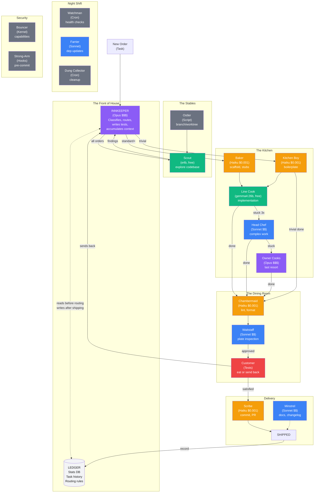

# The Inn Model: What Medieval Hospitality Teaches Us About AI Agent Orchestration

*A follow-up to [It's Markdown All the Way Down](blog-claude-code-agents.md)*

---

Last week I wrote about building a multi-model development pipeline out of markdown files and a command-line tool. The orchestrator writes tests, cheap local models implement, expensive cloud models review. It works. The pipeline is validated. The Rust microkernel it's supposed to build still doesn't have any Rust code.

Then I had a conversation with my AI about medieval inns, and now I think I accidentally stumbled onto a useful framework for thinking about agent orchestration.

## The Realization

Most agent frameworks think about two roles: a **planner** and an **executor**. Maybe a **reviewer** if they're fancy. That's a three-person restaurant — the owner takes your order, the cook makes it, someone checks it before it goes out.

But real restaurants have dozens of roles. And when I started listing what my development pipeline actually needs beyond "write code" and "review code," the list got long fast:

- Who scaffolds the files before the coder starts?
- Who cleans up lint and formatting after?
- Who writes the commit message?
- Who checks if the infrastructure is even running?
- Who updates dependencies?
- Who cleans up old branches and Docker images?
- Who writes the documentation?

These aren't nice-to-haves. These are the jobs that, when nobody does them, cause the "real" work to grind to a halt. Every experienced developer knows this: **most of the work in a software project isn't writing code.**

Then someone showed me a description of all the jobs at a medieval inn, and every single one mapped to something in a development pipeline.

## The Roster

A medieval inn on a major trade route might employ two dozen people across very specific roles. Here's how they map:

### The Kitchen (Implementation)



The **baker** and **kitchen boy** are prep cooks — they scaffold files, write boilerplate, create stubs. The cheapest model you have (Haiku at $0.001/task) handles this. The **line cook** does the real implementation — that's my local gemma4:26b on the GPU, free, 50 tokens per second. When the line cook gets stuck after three attempts, it escalates to the **head chef** (Sonnet), and if even that fails, the **owner** (Opus) reluctantly steps into the kitchen.

This escalation ladder existed in my pipeline already. What I didn't have were the prep cooks. The line cook was wasting time creating files and writing imports — work that a model 1/10th the size could handle.

### The Dining Room (Quality & Delivery)



Between the cook finishing and the reviewer inspecting, there's a **chambermaid** — a cheap model that does lint fixes, formatting cleanup, and dead code removal. This means the reviewer (Sonnet, not cheap) only sees real issues, not trivial style noise. After the customer (tests) is satisfied, a **scribe** (Haiku again) writes the commit message. Why burn Opus tokens on a commit message?

### The Stables (Infrastructure)

The **ostler** sets up the workspace — creates a git branch or worktree. The **stable boy** cleans up after: prunes Docker, deletes old branches. The **farrier** handles the specialized maintenance work of updating dependencies and applying security patches. The **yard man** hauls the firewood: starts Docker containers, checks GPU drivers, makes sure Ollama is running.

None of these are AI agents. They're scripts and cron jobs. But they're essential roles in the inn, and ignoring them is why pipelines break at 2 AM.

### Security (The Bouncer)

I'm building a Rust microkernel called "The Bouncer" — its core deliverable is capability enforcement. In the inn model, the bouncer is the kernel itself: checking contracts at the door, making sure modules can only access what they declared. The **strong-armed servant** is the pre-commit hook that blocks bad code from leaving the kitchen.

### The Night Shift

The **watchman** runs health checks. The **fire-tender** keeps models warm in memory. The **dung collector** cleans up Docker volumes and temp files. The **lamplighter** makes sure logging and observability are working.

These are all cron jobs. They cost nothing. They prevent everything else from falling apart.

## The Part Nobody Draws: Hidden Complexity

When I first drew this as a directed graph, it looked like a clean pipeline:

```
scout → prep → cook → clean → review → test → scribe → ship
```

Then I started asking questions and the linear model fell apart.

### The Innkeeper Is a Star, Not a Pipeline Head

Every interaction of consequence flows through the innkeeper (orchestrator):



The innkeeper isn't the first node in a chain. It's the **hub of a star topology**. It:

- **Accumulates context** across every stage (so the scribe can write a good commit message)
- **Reclassifies on failure** (a sent-back plate isn't always "try again" — sometimes it means "I misjudged the difficulty")
- **Mediates conflicts** (the chambermaid and reviewer can disagree)
- **Schedules parallel work** (multiple orders need separate worktrees and GPU time)
- **Reads the ledger** before routing new orders (adaptive, not static)

This is why the innkeeper is the most expensive model. It's not doing the most work — it's making the most decisions. Every fork in the pipeline is a judgment call, and judgment is what you're paying Opus for.

### Feedback Reclassification

When the customer sends a plate back, the innkeeper doesn't just retry:



Each failure is a decision tree, not an automatic retry loop. The orchestrator prompt I wrote says "if the coder's error output is identical across 3 dispatches, escalate immediately (it's stuck)." That's one branch. But it could also mean the tests are wrong, or the scout didn't find a critical dependency.

### The Chambermaid-Reviewer Tension

This one surprised me. If the chambermaid (cheap cleanup model) makes a change, the reviewer (expensive judgment model) now has to evaluate both the cook's work AND the chambermaid's changes. They can conflict:

> **Chambermaid:** "I removed this unused import."
> **Reviewer:** "That import was about to be used in the next function."

The solution: **restrict the chambermaid to provably-safe transforms.** Formatting (rustfmt, prettier), sorting imports, removing verified-unused code. Never semantic changes. Then the reviewer never conflicts because the chambermaid only touches style, never substance.

## The Economics

Every agent has a cost, and the inn model makes you think about it explicitly:

| Tier | Who | Cost | Use For |
|------|-----|------|---------|
| **Free** | Local models (26B, 4B) | $0 | Volume work, always-on |
| **Cheap** | Haiku | ~$0.001/task | Prep, cleanup, scribing |
| **Moderate** | Sonnet | ~$0.01/task | Review, complex cooking |
| **Expensive** | Opus | ~$0.10/task | Innkeeper only |
| **Zero** | Scripts, cron | $0 | Stables, night shift |

The insight: **most roles in the inn don't need the best cook.** The kitchen boy doesn't need to understand architecture. The chambermaid doesn't need to reason about algorithmic complexity. The scribe doesn't need to write code. Match the model to the role, and costs plummet while quality holds.

My slugify pipeline run cost roughly $0.12 total — and that's with Opus writing 27 tests and reviewing the results. The local model did the implementation for free. A Haiku chambermaid and scribe would have saved maybe $0.02 more. At scale, those savings compound.

## The Ledger: Where It Gets Adaptive

The static pipeline says "always route standard features to the line cook." The adaptive pipeline says "check the ledger first":



Over time, the ledger reveals patterns:
- "Line cook handles utility modules 95% of the time — stop sending those to the head chef"
- "Cross-file refactors need the head chef first try — skip the line cook"
- "The chambermaid step saves 2 reviewer comments per order — it's paying for itself"

This is a **multi-armed bandit problem** wearing an apron. Each cook is an "arm," each task type is a context. You're learning which arm gives the best reward (tests pass) at the lowest cost. Early on you explore (try the cheap cook on hard tasks). Once you have data, you exploit (route to the cook with the best track record for this task type).

The current stats format I collect is close but not enough. I'd need to add:
- Task type classification (rename, bug fix, feature, refactor, architecture)
- Complexity estimate vs. actual difficulty
- Full cost breakdown per stage
- Which agent actually resolved it (not just who tried first)

## Prior Art and What's New

I should be honest about what's established and what might be a genuine contribution.

**The individual concepts are all prior art:**

- Multi-agent systems — decades of research (Wooldridge & Jennings, 1990s)
- Capability-based security — KeyKOS (1980s), seL4, cap-std in Rust
- Economic resource allocation — operations research, mature field
- Multi-armed bandits — well-studied optimization
- TDD — Kent Beck, 2003
- Cost-optimized model routing — active area (Martian, Not Diamond, OpenRouter)
- Agent frameworks — LangChain, CrewAI, AutoGen

**What I think might be new, or at least under-explored:**

The **inn as a complete taxonomy**. Most agent frameworks model 2-3 roles. The inn model identifies 20+ distinct roles that map to real pipeline tasks. The chambermaid, the scribe, the farrier, the dung collector — these aren't in anyone's framework, but they're in everyone's TODO list.

The **star topology insight**. The orchestrator isn't the first node in a pipeline — it's the hub that every interaction flows through. This explains why the most expensive model is worth it: you're not paying for throughput, you're paying for decisions at every fork.

The **ledger-driven adaptive routing** as an explore/exploit problem. Static routing is what every pipeline does today. Adaptive routing based on historical success rates, framed as an inn's nightly accounting, makes it intuitive and implementable.

The **markdown-as-agents** implementation. No framework, no SDK, no DAG definition language. The orchestrator is a markdown file. The coder is a markdown file. The workflow is English prose executed by a language model that spawns copies of itself. The entire pipeline is four files totaling 400 lines.

And the **practical realization on consumer hardware**. This isn't a paper or a cloud-only demo. It's a working system on a library workstation with an RTX 4090, using free local models for the volume work and cloud models only for judgment calls. The first real pipeline run — 27 tests written, 27 tests passed, zero escalations, 10 minutes, $0.12.

## The Full Graph

Here's the complete directed graph of the inn — all roles, all interactions, all feedback loops:



## What I'm Building Next

The v0.1 spec for munews.app — "The Bouncer" — is a Rust microkernel with capability-enforced modules serving 103 hand-seeded stories. The pipeline that builds it has been validated. The models are benchmarked. The stats are tracked.

Now I'm going to use the inn model to expand the pipeline before I start writing Rust:

1. **Add prep cooks** (Haiku) — scaffold files before the coder starts
2. **Add the chambermaid** (Haiku) — cleanup pass between coder and reviewer
3. **Add the scribe** (Haiku) — commit messages without burning Opus tokens
4. **Add the watchman** (cron) — health checks before pipeline runs
5. **Start collecting richer stats** — task type, complexity, cost breakdown, actual resolver

Then I'll route the 10-task implementation plan through the pipeline and see if the inn can build a microkernel.

The toolbox is ready. The menu is written. The kitchen is staffed. Time to open the doors.

---

*Built on a Cincinnati library workstation. 32 cores, 124GB RAM, one RTX 4090, four markdown files, and a metaphor that got out of hand.*

---

## Further Reading

- [It's Markdown All the Way Down](blog-claude-code-agents.md) — the first post about the pipeline
- [The Inn Model — Design Document](design-the-inn-model.md) — full role taxonomy, economic model, and data collection requirements
- [v0.1 "The Bouncer" Spec](superpowers/specs/2026-04-01-munews-v01-bouncer-spec.md) — the Rust microkernel the inn will build
- [Architecture & Design Notes](architecture.md) — munews.app system design

### Prior Art References

- Wooldridge & Jennings, "Intelligent Agents: Theory and Practice" (1995) — foundational multi-agent systems survey
- Kent Beck, "Test-Driven Development: By Example" (2003) — the practice that became the inter-agent contract
- Mark S. Miller, "Robust Composition: Towards a Unified Approach to Access Control and Concurrency Control" (2006) — capability-based security theory
- The seL4 microkernel — formally verified capability enforcement, inspiration for The Bouncer
- Auer et al., "Finite-time Analysis of the Multiarmed Bandit Problem" (2002) — the math behind adaptive routing
- Anthropic, "Claude Code Documentation" (2025-2026) — the CLI that makes markdown-as-agents possible
