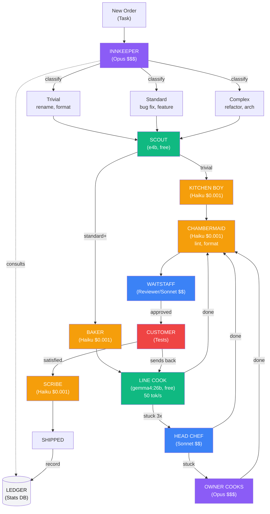

# The Inn Model: Agent Orchestration as a Medieval Economy

> Design document — brainstorming phase. Not a spec, not a plan. A way of thinking about multi-agent orchestration that maps surprisingly well to real software development pipelines.

## The Core Idea

A medieval inn is a surprisingly complete model for agent orchestration. Every role in the inn maps to a real task in a software development pipeline. Most "agent frameworks" only think about the cook (coder) and maybe the innkeeper (orchestrator). But a real inn has dozens of roles — and a real pipeline needs them too.

The insight: **most of the work in a software project isn't writing code.** It's cleanup, maintenance, provisioning, security, delivery, and keeping the lights on. The inn model captures all of it.

## The Directed Graph

> Full source: [`docs/diagrams/inn-model.dot`](diagrams/inn-model.dot) (Graphviz) and [`docs/diagrams/inn-model.mmd`](diagrams/inn-model.mmd) (Mermaid)
>
> Render DOT locally: `dot -Tsvg docs/diagrams/inn-model.dot -o docs/diagrams/inn-model.svg`



---

## The Full Roster

### The Inn Itself (Core Pipeline)

| Inn Role | Pipeline Role | Agent/Model | What It Does |
|----------|--------------|-------------|--------------|
| **Innkeeper** | Orchestrator | Opus | Manages the whole operation. Greets VIP orders (complex tasks), manages budget, negotiates with suppliers (API providers). Only cooks when everyone else has failed. |
| **Innkeeper's spouse** | CLAUDE.md + config | — | Co-manages. Knows the books (model roster, costs, capabilities). The innkeeper consults them before every decision. Not an agent — the configuration itself. |
| **Cook** | Coder | gemma4:26b / Sonnet | Prepares the main dishes. Takes orders (test specs), produces food (code). Judged by whether customers (tests) send it back. |
| **Kitchen boy / Scullion** | Prep coder | Haiku / local small | Grunt work the cook shouldn't waste time on. Scaffolding, boilerplate, file creation, import statements, type stubs. Cheap, fast, good enough. |
| **Spit-boy** | CI / Build runner | Script / Haiku | Keeps the fire turning. Runs the build, runs the tests, reports pass/fail. Doesn't cook — just tends the heat. Monotonous but critical. |
| **Tapster** | API gateway / Router | Core (axum) | Draws the right drink for each customer. Routes requests to the right handler. Knows what's on tap (available endpoints). Not an agent — infrastructure. |
| **Serving staff** | Response formatter | mod-render | Carries food from kitchen to table. Takes the cook's output and presents it to the customer. Never cooks. Inspects presentation. |

### Lodging and Housekeeping (Maintenance)

| Inn Role | Pipeline Role | Agent/Model | What It Does |
|----------|--------------|-------------|--------------|
| **Chambermaid** | Code cleaner | Haiku / Sonnet | Cleans up after the cook. Removes dead code, fixes lint warnings, organizes imports, tidies formatting. Runs after implementation, before review. |
| **Laundress** | Dependency cleaner | Haiku | Washes the linens. Removes unused dependencies, updates lock files, cleans build artifacts. Periodic, not per-task. |
| **Rushman** | Stale branch cleaner | Script | Replaces the foul rushes on the floor. Deletes merged branches, cleans up old worktrees, rotates logs, removes temp files. The job nobody wants but everyone needs. |

### Stables and Yard (Infrastructure)

| Inn Role | Pipeline Role | Agent/Model | What It Does |
|----------|--------------|-------------|--------------|
| **Ostler** | Git / worktree manager | Script / Haiku | Receives the horse (new task), unharnessses it (creates branch/worktree), beds it down (sets up workspace). Essential arrival ritual. |
| **Stable boy** | Workspace maintenance | Script | Mucks out stalls. Cleans build caches, prunes Docker images, frees disk space. Unglamorous, prevents disasters. |
| **Farrier** | Dependency doctor | Sonnet | Shoes the horses. Updates dependencies, applies security patches, handles version conflicts. Specialized skill — you don't want the kitchen boy doing this. |
| **Yard man** | Infrastructure ops | Script / Haiku | Hauls firewood, draws water. Starts Docker containers, checks Ollama health, ensures GPU drivers are loaded. The "is everything actually running?" person. |

### Security and Order (Quality & Safety)

| Inn Role | Pipeline Role | Agent/Model | What It Does |
|----------|--------------|-------------|--------------|
| **Bouncer** | Capability enforcer | The kernel itself | Already in the spec. Checks contracts at the door. If you don't have the right capabilities, you don't get in. The v0.1 deliverable. |
| **Watchman / Night porter** | Health monitor | Script / Cron | Guards the premises overnight. Checks that services are running, models are loaded, disk isn't full. Alerts when something's wrong. Doesn't fix — just watches. |
| **Strong-armed servant** | Pre-commit hooks | Hooks | Keeps peace in the common room. Validates that code meets standards before it leaves the kitchen. Blocks bad commits. Doesn't negotiate. |

### Supplies and Provisioning (Dependencies & Data)

| Inn Role | Pipeline Role | Agent/Model | What It Does |
|----------|--------------|-------------|--------------|
| **Brewer** | Package builder | Script / CI | Brews the ale on-site. Builds release artifacts, Docker images, binaries. Many inns brewed their own — many projects build their own tooling. |
| **Cellarman** | Cache / artifact manager | Script | Manages the stores. Knows what's in the cache, what's stale, what needs restocking. Manages model weights, build caches, dependency caches. |
| **Baker** | Scaffolder / generator | Haiku | Bakes bread daily. Generates boilerplate — new module skeletons, test file templates, config files. Repetitive, standardized, essential. |
| **Butcher** | Parser / transformer | Local model / Script | Slaughters and prepares. Transforms raw data into usable form — CSV to SQLite, JSON to typed structs, API responses to domain objects. The seed script is a butcher. |
| **Carter** | Fetcher / downloader | Script / Haiku | Goes to market. Downloads dependencies, fetches API specs, pulls model weights, retrieves remote configs. Knows the route to the suppliers. |

### Entertainment and Services (Documentation & Communication)

| Inn Role | Pipeline Role | Agent/Model | What It Does |
|----------|--------------|-------------|--------------|
| **Minstrel** | Doc writer / changelog | Sonnet | Draws customers in with stories. Writes documentation, changelogs, release notes. Makes the work legible to outsiders. Undervalued, essential for the inn's reputation. |
| **Barber** | Code formatter | rustfmt / prettier | Offers shaves and minor surgery. Applies formatting rules mechanically. Not creative work — precision work. Often a tool, not an agent. |
| **Scribe** | Commit message / PR writer | Haiku / Sonnet | Writes letters for travelers who can't write. Generates commit messages, PR descriptions, issue summaries. Knows the conventions. |

### Odd Jobs (Operations & Glue)

| Inn Role | Pipeline Role | Agent/Model | What It Does |
|----------|--------------|-------------|--------------|
| **Lamplighter** | Logger / observability | Script / Hook | Keeps candles burning. Ensures logging is working, metrics are flowing, dashboards are updating. If the lights go out, nobody can work. |
| **Errand boy** | General task runner | Haiku | Runs messages, fetches things. The cheapest agent for the simplest tasks. "Check if this file exists." "Count the lines in this test." "What's the current git branch?" |
| **Dung collector** | Garbage collection | Script / Cron | Hauls manure from the stables. Cleans up Docker volumes, old model weights, orphaned processes, temp databases. Sometimes sells to farmers (metrics from cleanup inform capacity planning). |
| **Fire-tender** | Service keepalive | Cron / Script | Keeps hearths lit throughout the building. Pings Ollama to keep models loaded, refreshes auth tokens, maintains websocket connections. Full-time job in a large inn. |

---

## The Economic Model

### Currency = Tokens (and Time)

Every agent costs something:

| Tier | Models | Cost | Speed | Use For |
|------|--------|------|-------|---------|
| **Free** | Local gemma4:26b, e4b | $0 | 13-50 tok/s | Volume work, always-on roles |
| **Cheap** | Haiku | ~$0.001/task | Fast | Errand boy, prep cook, baker, scribe |
| **Moderate** | Sonnet | ~$0.01/task | Fast | Head chef, chambermaid, farrier, minstrel |
| **Expensive** | Opus | ~$0.10/task | Slower | Innkeeper only. Menu design, VIP orders. |
| **Tools** | Scripts, cron, hooks | $0 | Instant | Rushman, spit-boy, bouncer, lamplighter |

### The Ledger

The innkeeper (orchestrator) keeps a nightly ledger:

```yaml
# docs/superpowers/stats/2026-04-03-slugify-utility.md
task: slugify utility
orders_served: 27          # tests passed
plates_returned: 0         # test failures
cook: line_cook (gemma4:26b)
cook_attempts: 1
escalated_to_head_chef: false
total_cost: $0.12          # orchestrator + reviewer tokens only
customer_satisfaction: 100%
```

Over time, the ledger reveals patterns:
- "Line cook handles utility modules 95% of the time — stop sending those to the head chef"
- "Prep cook (Haiku) can handle renames and formatting — don't waste the line cook"
- "Cross-file refactors need the head chef (Sonnet) first try — skip the line cook"

### Adaptive Routing (The Smart Innkeeper)

```
                    New Order Arrives
                          │
                          ▼
                 ┌─────────────────┐
                 │ CLASSIFY ORDER  │
                 │                 │
                 │ What dish is    │
                 │ this? Check the │
                 │ ledger for      │
                 │ similar orders. │
                 └────────┬────────┘
                          │
              ┌───────────┼───────────┐
              │           │           │
              ▼           ▼           ▼
         ┌─────────┐ ┌────────┐ ┌─────────┐
         │ SIMPLE  │ │STANDARD│ │ COMPLEX │
         │         │ │        │ │         │
         │ rename  │ │feature │ │refactor │
         │ format  │ │bug fix │ │arch     │
         │ scaffold│ │utility │ │cross-   │
         │         │ │        │ │module   │
         └────┬────┘ └───┬────┘ └────┬────┘
              │          │           │
              ▼          ▼           ▼
         Errand boy  Line cook  Head chef
         (Haiku)     (local)    (Sonnet)
         $0.001      $0.00      $0.01
              │          │           │
              └──────────┼───────────┘
                         │
                         ▼
                 ┌───────────────┐
                 │ PLATE CHECK   │
                 │ (Waitstaff /  │
                 │  Reviewer)    │
                 └───────┬───────┘
                         │
                    ┌────┴────┐
                    │         │
                    ▼         ▼
               Accepted   Returned
               (pass)     (fail)
                    │         │
                    ▼         ▼
               Log success  Escalate to
               in ledger    next cook up
                             │
                    ┌────────┼────────┐
                    │        │        │
                    ▼        ▼        ▼
               Head chef   Owner   BLOCKED
               (Sonnet)    (Opus)  (human)
```

---

## What Roles Are Missing From Current Pipeline

The current pipeline only has four roles: **innkeeper, cook, serving staff, and bouncer**. Here's what we're missing, prioritized by impact:

### High Value (add soon)

| Role | Why | Implementation |
|------|-----|----------------|
| **Kitchen boy** (prep coder) | Cook wastes time on scaffolding | Haiku agent: create files, stubs, boilerplate before cook starts |
| **Chambermaid** (code cleaner) | Reviewer catches style issues that a cheap model could fix first | Haiku/Sonnet post-implementation cleanup pass |
| **Watchman** (health monitor) | Pipeline fails mysteriously when Ollama is down or model unloaded | Cron job or pre-pipeline health check |
| **Scribe** (commit/PR writer) | Orchestrator wastes Opus tokens on commit messages | Haiku agent for mechanical writing tasks |

### Medium Value (add when pipeline is mature)

| Role | Why | Implementation |
|------|-----|----------------|
| **Farrier** (dependency doctor) | Security patches and version updates are recurring tasks | Sonnet agent, runs weekly |
| **Ostler** (workspace manager) | Manual branch/worktree management wastes human time | Script that sets up workspace per task |
| **Minstrel** (doc writer) | Docs rot without a dedicated role | Sonnet agent, post-merge documentation pass |
| **Errand boy** (quick tasks) | Many tasks don't need a coder at all | Haiku for sub-30-second tasks |

### Low Value (add when you have data)

| Role | Why | Implementation |
|------|-----|----------------|
| **Adaptive routing** (smart innkeeper) | Need task classification data first | Requires the ledger to have enough entries |
| **Fire-tender** (keepalive) | Only matters for long-running sessions | Cron or background script |
| **Dung collector** (cleanup) | Nice to have, not blocking | Periodic cleanup script |

---

## The Data Collection Problem

The inn model only works if the ledger is good. The current stats format captures:

```yaml
# What we collect now:
task: "description"
coder_model: "model name"
coder_iterations: N
tests_written: N
tests_passed: N
escalations: N
duration_m: N
```

What the inn model needs:

```yaml
# What we'd need to add:
task_type: new_feature | bug_fix | refactor | rename | scaffold | docs
task_complexity: trivial | simple | standard | complex | architectural
files_touched: N
lines_changed: N
initial_router_choice: "gemma4:26b"
actual_resolver: "gemma4:26b"    # who actually finished it
escalation_chain: ["gemma4:26b"] # or ["gemma4:26b", "sonnet"] if escalated
cost_breakdown:
  scout: {model: "e4b", tokens: 1200, cost_usd: 0.00}
  orchestrator: {model: "opus", tokens: 4500, cost_usd: 0.08}
  coder: {model: "gemma4:26b", tokens: 3400, cost_usd: 0.00}
  reviewer: {model: "sonnet", tokens: 2100, cost_usd: 0.02}
customer_satisfaction: 1.0       # tests_passed / tests_written
plates_returned: 0               # number of test failures before final pass
prep_work_done_by: "haiku"       # if kitchen boy was used
cleanup_done_by: "haiku"         # if chambermaid was used
```

With enough ledger entries, you can answer:
- "What's the cheapest model that handles bug fixes with >90% first-attempt success?"
- "Are we wasting Opus tokens on tasks Sonnet could handle?"
- "Does adding a kitchen boy (Haiku prep) reduce coder iterations?"
- "What task types cause the most escalations?"

---

## The Vision

```
Today:     Innkeeper → Cook → Waitstaff → Customer
           (static routing, 4 roles)

Tomorrow:  Innkeeper → classify → route → prep → cook → clean → inspect → serve
           (adaptive routing, 10+ roles, feedback loop)

Someday:   The inn runs itself. The innkeeper reviews the ledger each morning,
           adjusts the menu, hires cheaper cooks for dishes they can handle,
           and only steps into the kitchen for the dishes that truly need them.
           The human is the owner who checks in weekly to see if the inn is
           profitable and the customers are happy.
```

---

*"A well-run inn doesn't need its best cook on every dish. It needs the right cook on each dish, and a good enough ledger to know the difference."*

---

## Hidden Complexity: The Interactions Nobody Draws

The directed graph above is a simplification. Real inns have cross-cutting interactions that don't fit in a linear pipeline. These are the "more complex than you originally thought" patterns.

### 1. The Scribe Problem (Context Aggregation)

The scribe needs to know the full story of every order — not just the final dish. A good commit message requires context from every stage:

```
innkeeper decided  → "this is a standard utility task"
scout found        → "src/ exists, tests use pytest, no existing slug utils"
innkeeper wrote    → "27 tests across 4 classes"
cook implemented   → "4-step regex pipeline, 21 lines"
chambermaid fixed  → "redundant bracket cleanup"
reviewer flagged   → "3 design items deferred, 1 auto-fixed"
customer verdict   → "27/27 pass, zero escalations"
```

This means someone has to **accumulate context** across the entire pipeline. In practice, the innkeeper (orchestrator) is the only agent who sees every stage. The scribe doesn't watch agents directly — **the innkeeper hands it the full narrative at the end.**

This is a general pattern: **any agent that needs cross-stage context gets it from the innkeeper, not by observing other agents.**

### 2. The Scout Fan-Out (One Source, Many Consumers)

The scout's findings feed multiple downstream agents, but each needs different things:

```
                    ┌──► Innkeeper: "what test patterns to follow?"
                    │
Scout findings ─────┼──► Baker: "what files to scaffold?"
                    │
                    └──► Cook: "what existing code to integrate with?"
```

In the current pipeline this is implicit — the innkeeper reads the scout's output and extracts the relevant bits for each downstream agent. But it means **the quality of the innkeeper's summarization directly affects every downstream agent.** A bad summary from a lazy innkeeper (or a poorly-written orchestrator prompt) cascades through the whole pipeline.

### 3. The Feedback Reclassification (Sent-Back Plates)

When the customer sends a plate back (tests fail), the linear graph shows it going straight back to the cook. But reality is messier:

```
Customer sends back plate
         │
         ▼
    Innkeeper re-evaluates:
         │
         ├── "Same cook, just needs another attempt"
         │     → send back to line cook with failure output
         │
         ├── "This is harder than I classified it"
         │     → RECLASSIFY: upgrade from standard → complex
         │     → send to head chef instead
         │
         ├── "My tests were wrong"
         │     → rewrite tests, start over
         │
         └── "The scout missed something"
              → re-dispatch scout for more context
              → then re-attempt with better info
```

**The innkeeper is the feedback router, not just a classifier.** Each failure is a decision point, not an automatic retry. This is why the orchestrator is the most expensive model — it's making judgment calls at every fork.

### 4. The Chambermaid-Reviewer Tension

The chambermaid (Haiku cleanup) and reviewer (Sonnet) can conflict:

```
Chambermaid: "I removed this unused import"
Reviewer:    "Actually that import was about to be used in the next function"

Chambermaid: "I reformatted this match statement to one line"  
Reviewer:    "That was clearer as multiple lines"
```

The chambermaid is cheap and fast but lacks context about intent. The reviewer has more judgment but costs more. Two resolution patterns:

**Pattern A: Chambermaid first, reviewer accepts/reverts**
Cheaper — the chambermaid handles 80% of cleanup correctly. The reviewer only intervenes when the chambermaid made it worse. But the reviewer now has to diff against BOTH the cook's output AND the chambermaid's changes.

**Pattern B: Reviewer first, chambermaid never runs**
Simpler — but the reviewer wastes expensive tokens on trivial lint fixes.

**Pattern C (best): Chambermaid only does safe transforms**
Restrict the chambermaid to provably-safe changes: formatting (rustfmt/prettier), removing verified-unused imports, sorting use statements. Never let it make semantic changes. Then the reviewer never conflicts because the chambermaid only touches style, never substance.

### 5. The Mid-Pipeline Scout Re-Dispatch

Sometimes the cook realizes it needs more context mid-implementation:

```
Cook is implementing...
  → "Wait, where does this type come from?"
  → "I need to check the database schema"
  → "Is there an existing utility for this?"
```

In the linear model, the scout runs once at the start. But in practice, **the cook sometimes needs to send the runner back to the pantry.** This creates a loop:

```
Cook ──► "Need more context" ──► Scout ──► Cook (resumed with new info)
```

The question is: does the cook dispatch the scout directly, or does it signal the innkeeper to do it?

**Direct dispatch** is faster but means the cook needs tool permissions to spawn agents.
**Innkeeper-mediated** is cleaner but adds a round-trip through the most expensive model.

For now, the coder agent has read-only tools (Glob, Grep, Read) so it can scout for itself on simple lookups. The dedicated scout is for the initial broad reconnaissance that the coder shouldn't waste time on.

### 6. The Parallel Kitchen (Multiple Orders at Once)

The inn doesn't serve one customer at a time. Multiple orders come in:

```
Order A: "Add slugify utility"     → Line Cook 1 (worktree A)
Order B: "Fix URL validator bug"   → Line Cook 2 (worktree B)
Order C: "Rename config module"    → Kitchen Boy  (worktree C)
```

This requires:
- **Separate workspaces** (git worktrees) so cooks don't clobber each other
- **GPU contention management** — only one model loaded at a time on the 4090
- **Merge conflict resolution** when orders touch the same files
- **Priority queue** — VIP orders (blocking bugs) jump ahead of routine dishes

The innkeeper becomes a **scheduler**, not just a classifier. This is where the inn model maps to real queuing theory: you're optimizing throughput across a kitchen with limited burners (GPU) and shared ingredients (files).

### 7. The Ledger Feeds the Innkeeper (Closing the Loop)

The ledger isn't just a log — it's the innkeeper's **decision support system:**

```
Before classifying a new order:
  Innkeeper reads ledger:
    → "Last 5 'rename' tasks: kitchen boy handled 100%, avg 8 seconds"
    → "Last 3 'refactor' tasks: line cook failed 2/3, head chef resolved"
    → "The chambermaid cleanup step saved 2 reviewer comments per order"
    
  Innkeeper decides:
    → Route this rename to kitchen boy (skip line cook entirely)
    → Route this refactor directly to head chef (skip line cook)
    → Keep the chambermaid step (it's paying for itself)
```

This is the **adaptive routing** from the economic model, but the mechanism is concrete: **the innkeeper reads the stats files before making routing decisions.** The orchestrator prompt could literally say "read docs/superpowers/stats/ and use historical outcomes to inform your routing."

### The Real Graph

```
                         ┌───────────────────────────────────────┐
                         │           THE INNKEEPER               │
                         │     (sees everything, decides everything)
                         │                                       │
                reads ◄──┤   Accumulates context across stages   ├──► writes
               ledger    │   Routes feedback, not just tasks     │    ledger
                         │   Reclassifies on failure             │
                         │   Schedules parallel work             │
                         │   Hands full narrative to scribe      │
                         └──┬────┬────┬────┬────┬────┬────┬──────┘
                            │    │    │    │    │    │    │
                            ▼    ▼    ▼    ▼    ▼    ▼    ▼
                         scout baker cook  maid  rev  test scribe
                            │         ▲    ▲         │
                            │         │    │         │
                            └─────────┘    └─────────┘
                          re-dispatch      conflict resolution
                          on demand        (safe transforms only)
```

The innkeeper isn't just the first node in a pipeline. **It's the hub of a star topology** — every interaction of consequence flows through it. That's why it's the most expensive model. It's not doing the most work; it's making the most decisions.

---

*"The innkeeper never sleeps, sees every plate, hears every complaint, and remembers every night's receipts. That's why you pay them the most."*
